# Qualcomm RB3 Gen 2 & FoundriesFactory: A Powerful Duo for Embedded Development

The Qualcomm RB3 Gen 2 Development Kit, in combination with the FoundriesFactory platform, provides a powerful and efficient solution for embedded AI and IoT development. This project explores how the Qualcomm RB3 Gen 2 hardware integrates with FoundriesFactory’s DevSecOps environment, enabling rapid prototyping, development, and deployment of industrial and commercial IoT solutions.

Equipped with a Qualcomm® QCS6490 chipset, advanced AI capabilities, and dedicated video processing, the RB3 Gen 2 Development Kit is an ideal platform for edge AI, robotics, smart cameras, kiosks, and industrial automation. The FoundriesFactory platform further enhances development by offering secure over-the-air (OTA) updates, Linux microPlatform (LmP) support, and automated security compliance to simplify software management and deployment.

This project aims to demonstrate how embedded developers can:
-  **Accelerate development** using FoundriesFactory for seamless software deployment, testing, and validation.

-   **Optimize AI and IoT applications** by leveraging Qualcomm’s powerful AI, video processing, and compute capabilities.

-   **Ensure security and compliance with TUF-based OTA updates** for continuous protection and reliability.

-   **Streamline the transition from prototype to production** through an integrated DevSecOps workflow.

-   **Enhance Linux-based development** with LmP, SDKs, and tools tailored for AI, multimedia, and robotics.

By combining the performance of Qualcomm RB3 Gen 2 with the security and efficiency of FoundriesFactory, this project highlights a scalable, secure, and high-performance approach to embedded AI and IoT development.


## Prerequisites
1. A Linux host system with Ubuntu 20 onwards
2. RB3 Gen2 Vision Kit
3. Display Monitor for visulization

## Getting Started with the FoundriesFactory Platform 

Follow these steps to set up and use the FoundriesFactory™ Platform with the Qualcomm RB3 Gen 2 Development Kit:

1. To start a new Factory, please visit https://app.foundries.io/ and sign up for an account.
2. In the Platform drop down, choose Qualcomm RB3 Gen 2 Development Kit.
3. Give your Factory a name, and click "Create Factory".
4. The Factory owners may invite additional users to their FoundriesFactory Account via email under the "Members" tab of the Factory interface.
    - Manage your Factory users: ```https://app.foundries.io/factories/<factory>/members/```

   `<factory>` --->   Your Factory name  

5. Fioctl CLI Installation: https://docs.foundries.io/latest/getting-started/install-fioctl/index.html
6. Configure git using Fioctl: https://docs.foundries.io/latest/getting-started/git-config/index.html

**Reference**

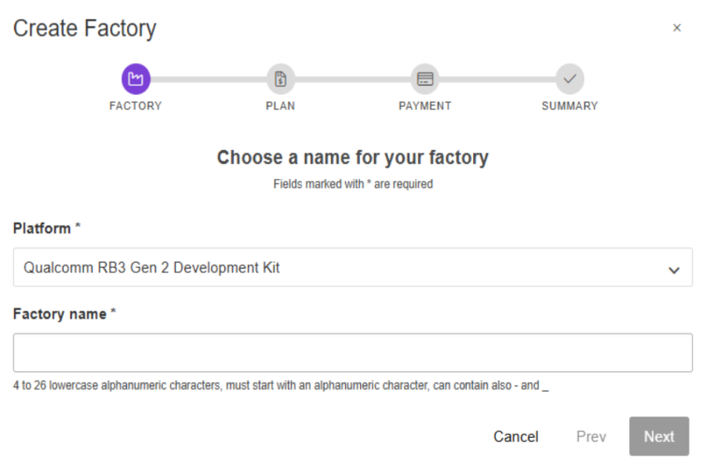

### Qualcomm Robotics RB3G2 Development Kit

Once your Factory has been created, it will build the source code for the RB3G2 and produce a Target. A Target is a secure over-the-air update but also provides the build artifacts for initial provisioning.

1. Download the image: ```https://app.foundries.io/factories/<factory>/targets/1/artifacts/qcm6490/lmp-factory-image-qcm6490-rb3gen2-vision-kit.qcomflash.tar.gz```
2. Extract the `tar.gz` into a known location.
3. Open a terminal and change the directory into `lmp-factory-image-qcm6490`.
4. The compressed archive contains the flashing tool “qdl”.
   - Note: The tool from the build has the interpreter set incorrectly.
5. Download and compile qdl for your platform:
   - `git clone https://github.com/linux-msm/qdl`
   - Read the README and install build dependencies
   - `cd qdl`
   - `make`
6. Disable ModemManager on some host systems if necessary.

Now configure the Qualcomm® Robotics RB3G2 Development Kit:

1. Set up DIP_SW_0 positions 1 and 2 to ON. This enables serial output to the debug port.
2. Connect the USB debug cable to the host. Baud rate is 115200.
   - You can use your favorite UART client to access the console, such as minicom, putty etc.
3. The serial connection is based on the FTDI chip:
   - `/dev/serial/by-id/usb-FTDI_FT230X_Basic_UART_<serial ID>-if00-port0`
4. Plug in the USB-C cable from the host.
5. Run the command to flash:
   - `./qdl prog_firehose_ddr.elf rawprogram*.xml patch*.xml`
6. Press and hold the F_DL button and connect the power cable.

**Reference**

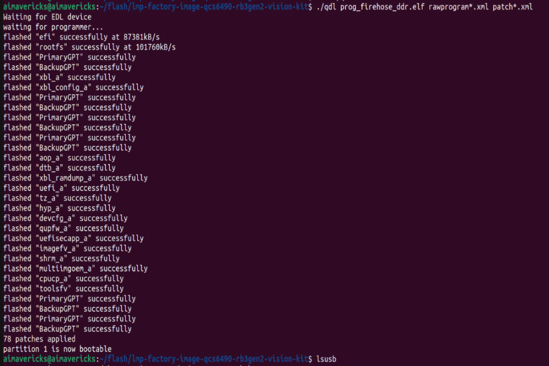

### Serial Console

After flashing, the device should boot the Linux microPlatform properly. Use your serial console to log in [Link](https://docs.qualcomm.com/bundle/publicresource/topics/80-70017-253/set_up_the_device.html?product=1601111740013077#panel-0-vwj1bnr1tab$set-up-the-ubuntu-host).

Successfully flashed and deployed the Linux microPlatform (LmP) on embedded devices, ensuring proper boot-up and system functionality. Configured and accessed the device via a serial console, enabling low-level debugging, system monitoring, and remote command execution.


Username: `fio`
Password: `fio`

**Reference**

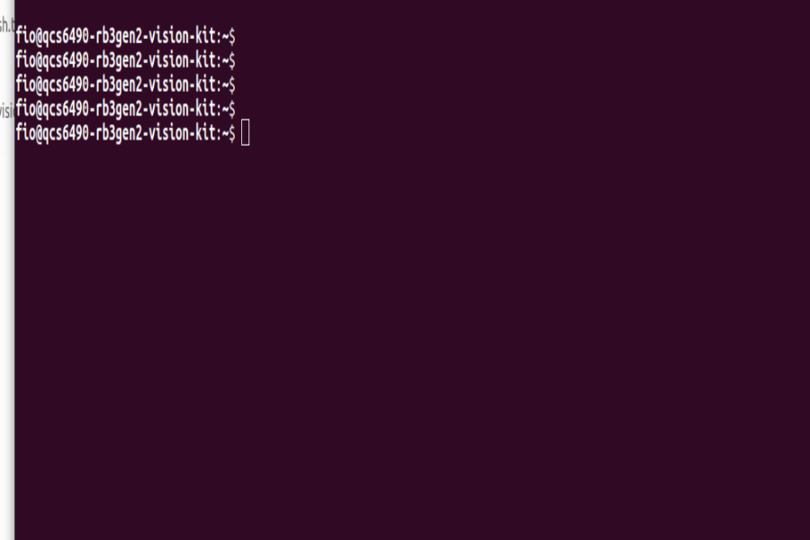

### Connect via WiFi

Using the WiFi radio, connect it to the internet using NetworkManager CLI:

```
sudo nmcli device wifi connect “<AP Name>” password “<AP password>”
```

The sudo password is `fio`.

### Enabling Ethernet and USB

To enable Ethernet, the required firmware must be included in the Yocto recipe below. This is a one-time process that will also activate USB Type-A ports.

Register and log in to https://www.renesas.com, then download firmware from
https://www.renesas.com/us/en/products/interface/usb-switches-hubs/upd720201-usb-30-host-controller.

Once downloaded, copy USB3-201-202-FW-20131112.zip at recipes-firmware/firmware/renesas-upd720201
and add the renesas-upd720201 package to your image.

#### Add downloaded firmware zip to the correct layer location

```bash
git clone https://source.foundries.io/factories/<factory>/meta-subscriber-overrides.git
cd meta-subscriber-overrides
mkdir -p recipes-firmware/firmware/renesas-upd720201
cp /tmp/USB3-201-202-FW-20131112.zip recipes-firmware/firmware/renesas-upd720201
echo 'FILESEXTRAPATHS:prepend := "${THISDIR}/${PN}:"' > recipes-firmware/firmware/renesas-upd720201_20131112.bbappend
echo 'SRC_URI += "file://USB3-201-202-FW-20131112.zip"' >> recipes-firmware/firmware/renesas-upd720201_20131112.bbappend
```

#### Add renesas-upd720201 to lmp-factory-image

```bash
echo 'CORE_IMAGE_BASE_INSTALL += "renesas-upd720201"' >> recipes-samples/images/lmp-factory-image.bb
```

#### Commit and push to create a new build
```bash
git add .
git commit -s -m "renesas-upd720201: add firmware file"
git push
```

After you push, the FoundriesFactory will build a new target. Once built, any registered device will update over the air.


### SSH

Once connected to the network you can log in over ssh if desired:

```bash
ssh fio@qcs6490-rb3gen2-vision-kit.local
```

OR

```bash
ssh fio@<IP>
```

Password: `fio`

---

### Register Your Device

Register your device with FoundriesFactory:
https://docs.foundries.io/latest/getting-started/register-device/index.html


**Reference**

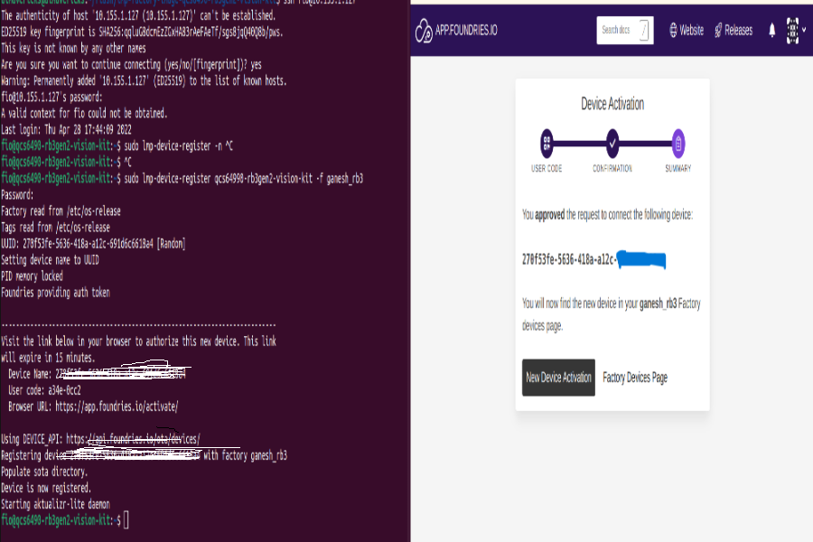
---


### Qualcomm AI Hub

[Qualcomm® AI Hub](https://aihub.qualcomm.com/get-started) simplifies deploying AI models for vision, audio, and speech applications to edge devices. You can optimize, validate, and deploy your own AI models on hosted Qualcomm platform devices within minutes.


### shellhttpd

This is a simple httpd server, built from a Dockerfile in the factory source code. Enable the shellhttpd compose app before deployment:

```bash
git clone https://source.foundries.io/factories/<factory>/containers.git
git mv shellhttpd.disabled shellhttpd
git commit -s -m “enable shellhttp” && git push
```

This compose-app does not require any hardware other than a network connection.


### gst-concurrent-videoplay-composition

The gst-concurrent-videoplay-composition tool enables concurrent AVC video decoding, playback, and composition for video wall applications. It requires at least one MP4 input file with the AVC codec.

For a more detailed description please see [Qualcomm Linux Sample Apps](https://docs.qualcomm.com/bundle/publicresource/topics/80-70014-50/gst-concurrent-videoplay-composition.html?product=1601111740013072&facet=Qualcomm%20Intelligent%20Multimedia%20SDK).

Enable the gst-concurrent-videoplay-composition compose app before deployment:

```bash
git clone https://source.foundries.io/factories/<factory>/containers.git
git mv gst-concurrent-videoplay-composition.disabled gst-concurrent-videoplay-composition
git commit -s -m “gst-concurrent-videoplay-composition” && git push
```

This compose-app requires a connected display to function properly.

### gst-ai-classification

The gst-ai-classification application performs subject recognition in images using the Qualcomm Neural Processing SDK or TensorFlow Lite (TFLite) runtime. The compose file includes configurable commands for selecting different classification models.


Enable the gst-ai-classification compose app before deployment:

```bash
git clone https://source.foundries.io/factories/<factory>/containers.git
git mv gst-ai-classification.disabled gst-ai-classification
git commit -s -m “gst-ai-classification” && git push
```

This compose-app requires a connected display and the camera mezzanine to function properly.

### gst-ai-daisychain-detection-classification

The gst-ai-daisychain-detection-classification application enables cascaded object detection and classification from a camera or file source, identifying and categorizing detected objects.

Enable the gst-ai-daisychain-detection-classification compose app before deployment:

```bash
git clone https://source.foundries.io/factories/<factory>/containers.git
git mv gst-ai-daisychain-detection-classification.disabled gst-ai-daisychain-detection-classification
git commit -s -m “gst-ai-daisychain-detection-classification” && git push
```

This compose-app requires a connected display and the camera mezzanine to function properly.

### gst-ai-monodepth

The gst-ai-monodepth application enables you to infer depth from a live camera stream.


Enable the gst-ai-monodepth compose app before deployment:

```bash
git clone https://source.foundries.io/factories/<factory>/containers.git
git mv gst-ai-monodepth.disabled gst-ai-monodepth
git commit -s -m “gst-ai-monodepth” && git push
```

This compose-app requires a connected display and the camera mezzanine to function properly.

### gst-ai-object-detection

The gst-ai-object-detection application detects objects in images and videos, supporting YOLOv5, YOLOv8, and YOLO-NAS with the Qualcomm Neural Processing SDK runtime.

Enable the gst-ai-object-detection compose app before deployment:

```bash
git clone https://source.foundries.io/factories/<factory>/containers.git
git mv gst-ai-object-detection.disabled gst-ai-object-detection
git commit -s -m “gst-ai-object-detection” && git push
```

This compose-app requires a connected display and the camera mezzanine to function properly.

### gst-ai-parallel-inference

The gst-ai-parallel-inference application performs object detection, classification, pose detection, and image segmentation on live camera streams. It utilizes the Qualcomm Neural Processing SDK for detection and segmentation and TFLite for classification and pose estimation.


Enable the gst-ai-parallel-inference compose app before deployment:

```bash
git clone https://source.foundries.io/factories/<factory>/containers.git
git mv gst-ai-parallel-inference.disabled gst-ai-parallel-inference
git commit -s -m “gst-ai-parallel-inference” && git push
```

This compose-app requires a connected display and the camera mezzanine to function properly.

### gst-ai-pose-detection

The gst-ai-pose-detection application identifies body poses in images or videos using a camera stream. It leverages TFLite for pose estimation and displays the results on screen.

Enable the gst-ai-pose-detection compose app before deployment:

```bash
git clone https://source.foundries.io/factories/<factory>/containers.git
git mv gst-ai-pose-detection.disabled gst-ai-pose-detection
git commit -s -m “gst-ai-pose-detection” && git push
```

This compose-app requires a connected display and the camera mezzanine to function properly.

### gst-ai-segmentation

The gst-ai-segmentation application partitions images into meaningful segments, assigning labels based on attribute similarity. It demonstrates image segmentation using both the Qualcomm Neural Processing SDK and TFLite runtimes.


Enable the gst-ai-segmentation compose app before deployment:

```bash
git clone https://source.foundries.io/factories/<factory>/containers.git
git mv gst-ai-segmentation.disabled gst-ai-segmentation
git commit -s -m “gst-ai-segmentation” && git push
```

This compose-app requires a connected display and the camera mezzanine to function properly.

### gst-multi-camera-example

The gst-multi-camera-example application enables simultaneous streaming from two camera sensors. It combines feeds for display or encodes and saves them to a file. This serves as a reference for multi-camera use cases such as dash cameras and stereo vision systems.


Enable the gst-multi-camera-example compose app before deployment:

```bash
git clone https://source.foundries.io/factories/<factory>/containers.git
git mv gst-multi-camera-example.disabled gst-multi-camera-example
git commit -s -m “gst-multi-camera-example” && git push
```

This compose-app requires a connected display and the camera mezzanine to function properly.

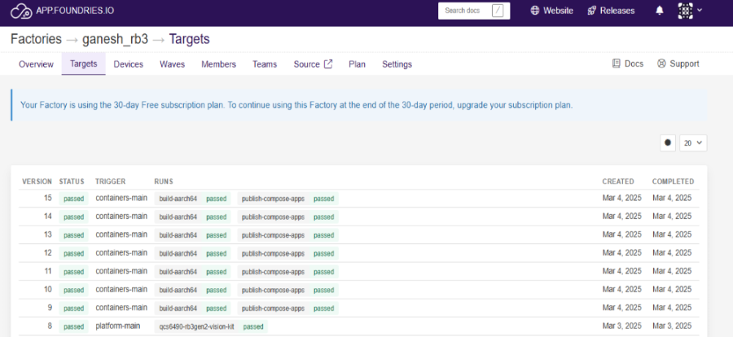

### Deploy

After you push, the FoundriesFactory will build a new target. Afterwards, deploy as described below.


## Fioctl

Fioctl is a command-line tool to manage your Factory. To deploy applications listed below, you must have enabled them first as described above. The polling time on devices by default is five minutes, once you have issued your deployment command, please wait up to five minutes to see the change reflected.

### Examples:

#### View Targets:

  ```bash
  ./fioctl targets list -f <factory>
  ```
#### View Devices:

  ```bash
  ./fioctl devices list -f <factory>
  ```
#### Change Device Tag:

  ```bash
  ./fioctl devices -f <factory> config updates <device_name> --tags <tag_name>
  ```
#### Change Device Application:

  ```bash
  ./fioctl devices -f <factory> config updates <device_name> --apps <app_name1>,<app_name2>,<app_name3>
  ```
#### Deploy shellhttpd Application:

  ```bash
  ./fioctl devices -f <factory> config updates <device_name> --apps shellhttpd
  ```
Device: wget -qO- 127.0.0.1:8080
Output: Hello world

#### Deploy gst-concurrent-videoplay-composition Application:

  ```bash
  ./fioctl devices -f <factory> config updates <device_name> --apps gst-concurrent-videoplay-composition
  ```
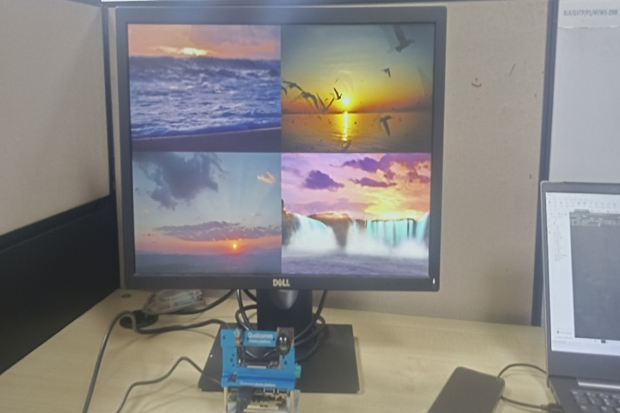

#### Deploy gst-ai-classification Application:

  ```bash
  ./fioctl devices -f <factory> config updates <device_name> --apps gst-ai-classification
  ```
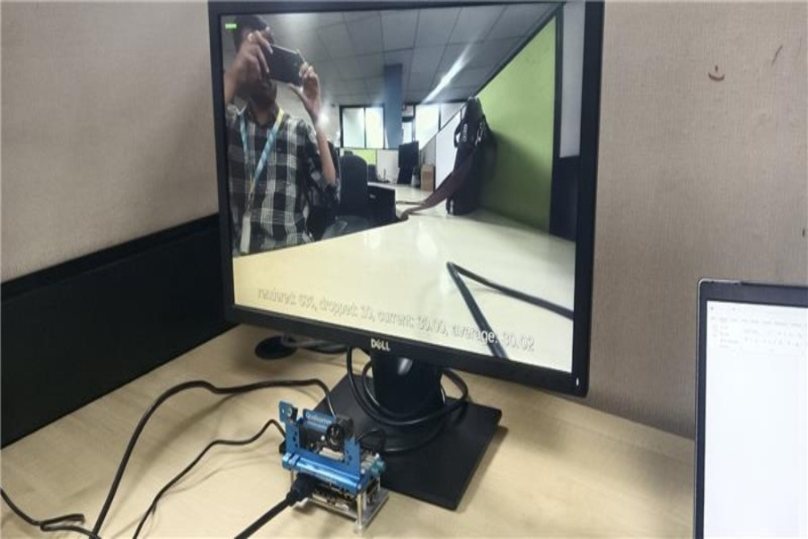

#### Deploy gst-ai-daisychain-detection-classification Application:

  ```bash
  ./fioctl devices -f <factory> config updates <device_name> --apps gst-ai-daisychain-detection-classification
  ```
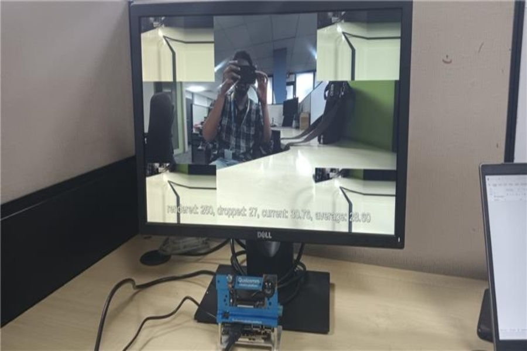

#### Deploy gst-ai-monodepth Application:

  ```bash
  ./fioctl devices -f <factory> config updates <device_name> --apps gst-ai-monodepth
  ```
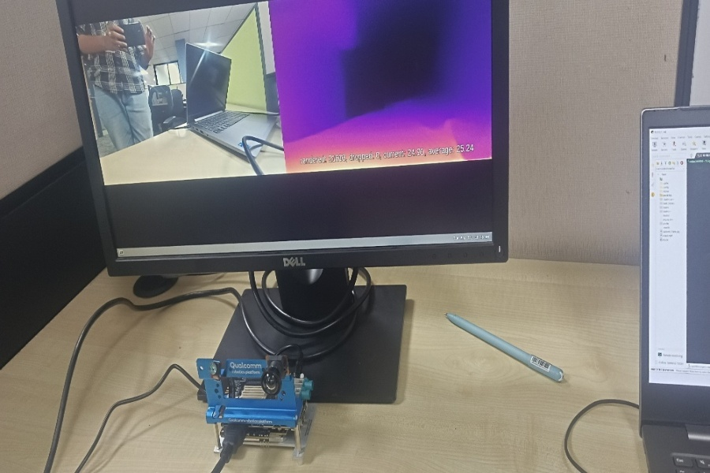

#### Deploy gst-ai-object-detection Application:

  ```bash
  ./fioctl devices -f <factory> config updates <device_name> --apps gst-ai-object-detection
  ```
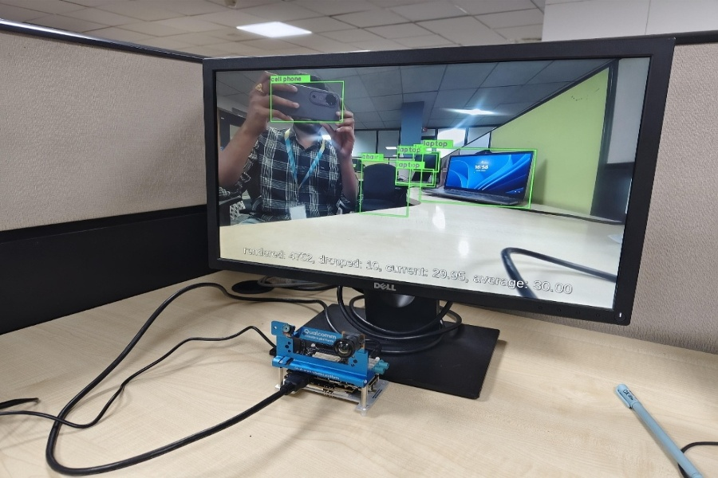

#### Deploy gst-ai-parallel-inference Application:

  ```bash
  ./fioctl devices -f <factory> config updates <device_name> --apps gst-ai-object-detection
  ```
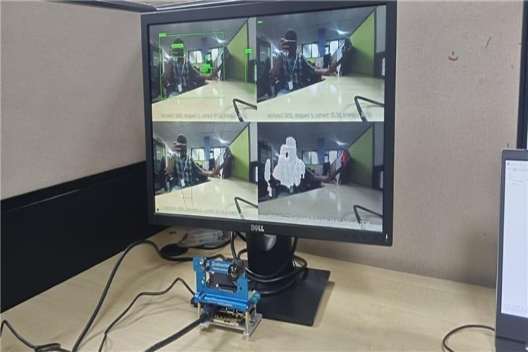

#### Deploy gst-ai-pose-detection Application:

  ```bash
  ./fioctl devices -f <factory> config updates <device_name> --apps gst-ai-pose-detection
  ```
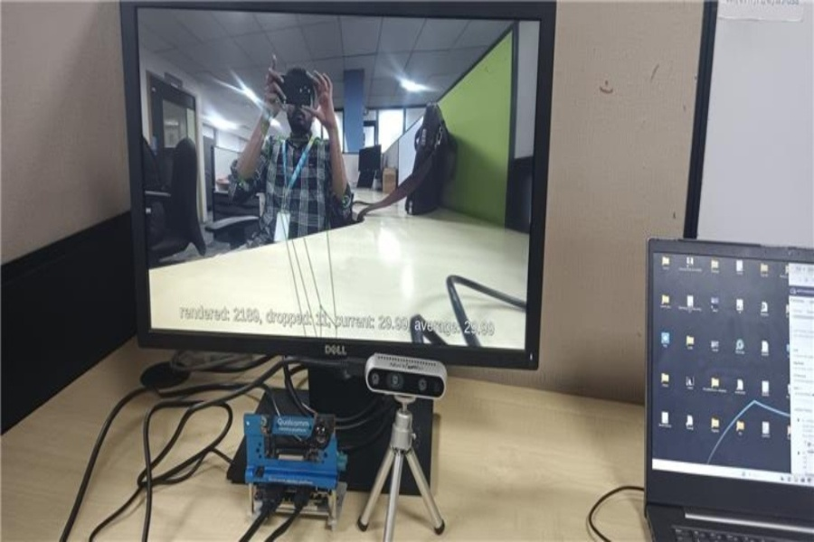

#### Deploy gst-ai-segmentation Application:

  ```bash
  ./fioctl devices -f <factory> config updates <device_name> --apps gst-ai-segmentation
  ```
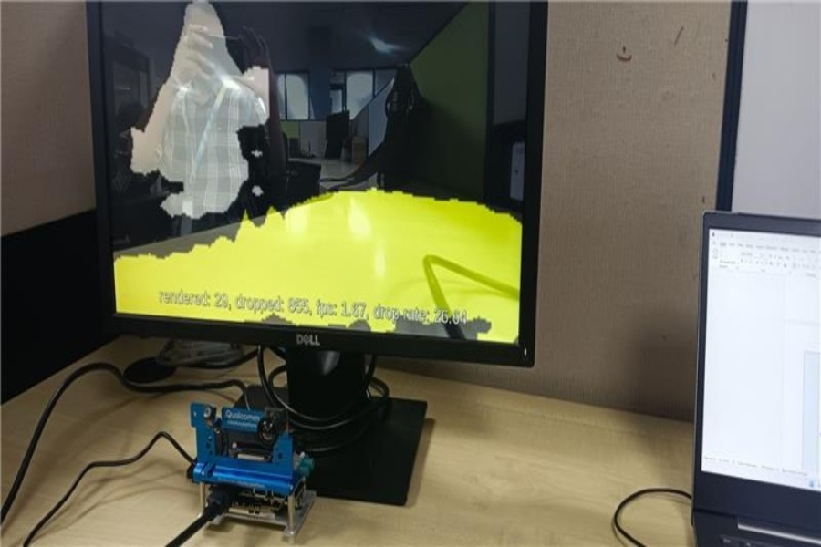

#### Deploy gst-multi-camera-example Application:

  ```bash
  ./fioctl devices -f <factory> config updates <device_name> --apps gst-multi-camera-example
  ```
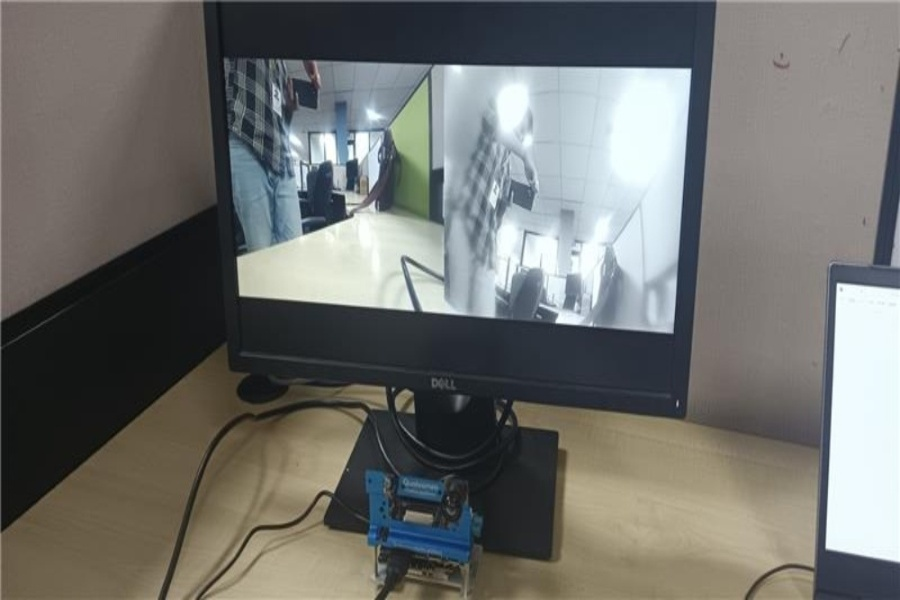

## Update Tags and Apps in FoundariesFactory

In FoundriesFactory, you can deploy specific applications to registered embedded devices by selecting preset tags and apps.

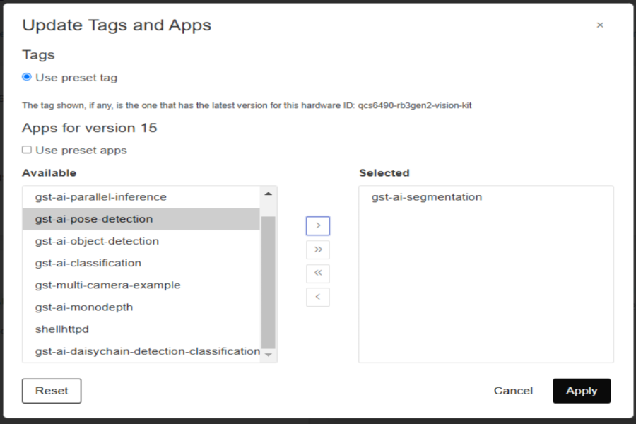

---
